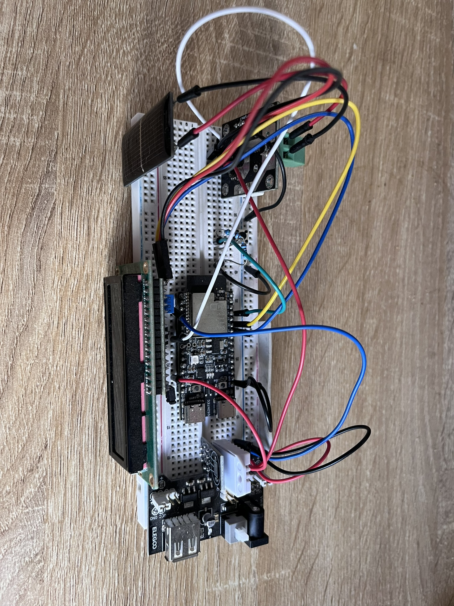
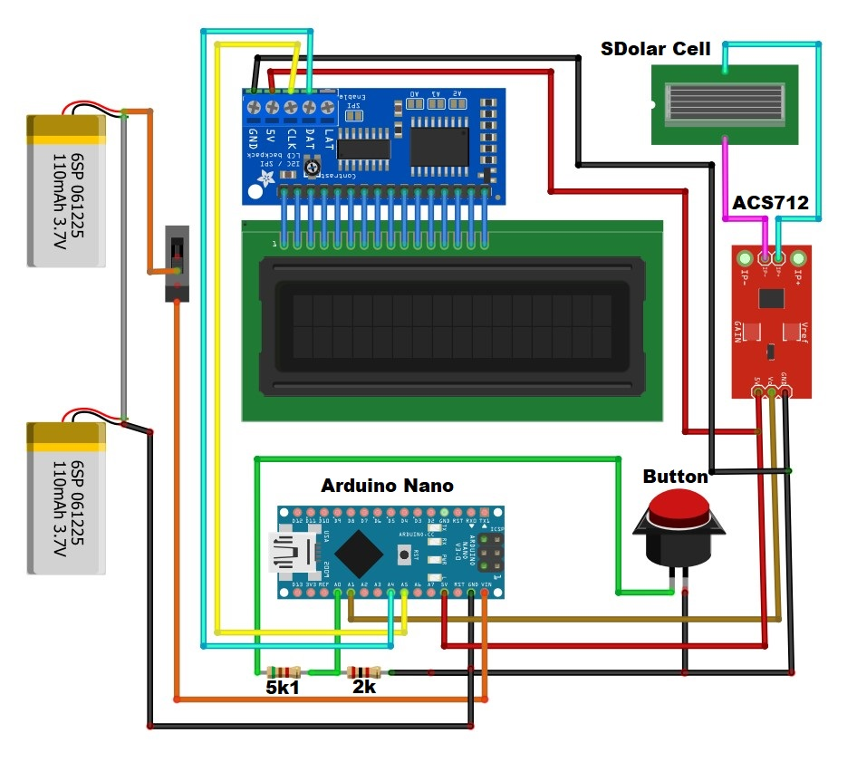
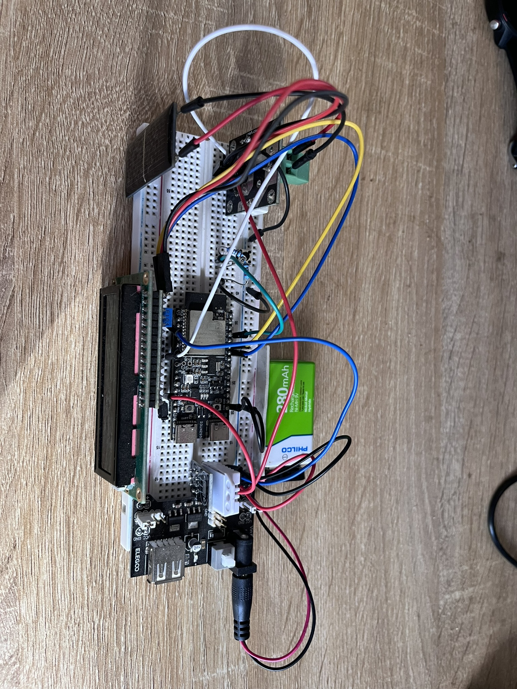
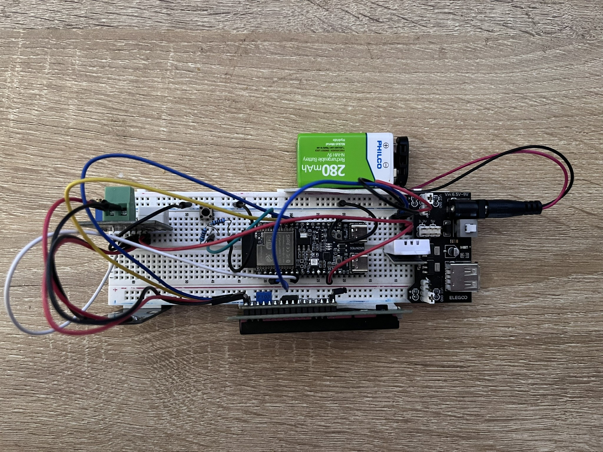
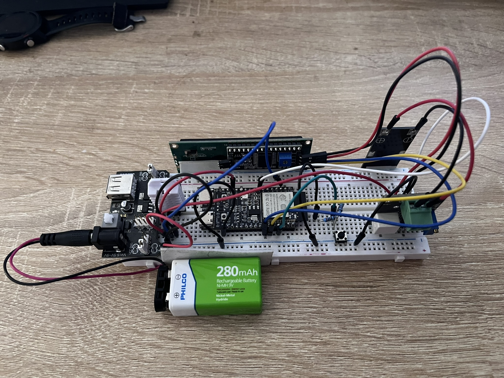

# Solar Irradiation Meter - ESP32-C6 Connection Guide

## Project Overview

*DIY Weather Station prototype with solar irradiation measurement*


## Hardware Components
- ESP32-C6-DevKit1
- WCS2702 Current Sensor
- 16x2 I2C LCD Display Module
- Solar Cell (0.5V/250mA Mini Solar Panel)
- 1x Batería 9V
- 1x Resistencia 5.1kΩ
- 1x Resistencia 2kΩ
- 1x Botón pulsador
- 1x Interruptor de encendido
- Cables de conexión

## Connection Diagram

### Schematic

*Schematic diagram of the weather station connections*

### ASCII Diagram

```
    +------------------+
    |     Battery      |
    |        9V        |     +-----------------+
    |                  |     |     I2C LCD     |
    +--------+---------+     |     Display   | |
             |               +--------+--------+
             |                        |
    [Power Switch]              VCC  GND  SDA  SCL
             |                   |    |    |    |
    +--------+---------+         |    |    |    |
    |    ESP32-C6      |         |    |    |    |
    |                  |         |    |    |    |
    |             VIN +-<--------+    |    |    |
    |             GND +-<-------------+    |    |
    |           GPIO21+-<----------------[5.1kΩ]-+
    |           GPIO22+-<-----------------[2kΩ]--+
    |                  |                  |    |
    |      GPIO1(ADC)  +----+             |    |
    |                  |     |            |    |
    |            GPIO0 +--+  |            |    |
    +------------------+   | |            |    |
                         | | |            |    |
    +------------------+ | | |            |    |
    |  Solar Cell      | | | |            |    |
    | (0.5V/250mA)     | | | |            |    |
    +--------+---------+ | | |            |    |
             |           | | |            |    |
    +--------+---------+ | | |            |    |
    |     WCS2702      | | | |            |    |
    |                  | | | |            |    |
    |  IP+       VCC +---+ | |            |    |
    |  IP-       GND +-------+            |    |
    |            OUT +--------------------+    |
    +------------------+                       |
                                               |
    [Button]---+                               |
               |                               |
               +-------------------------------+

```

## Pin Connections

### Alimentación
- Batería 9V → Interruptor → VIN del ESP32-C6
- GND común para todos los componentes

### WCS2702 Current Sensor
- VCC → ESP32-C6 3.3V
- GND → ESP32-C6 GND
- OUT → ESP32-C6 GPIO1 (ADC)
- IP+ → Solar Cell Positivo
- IP- → Solar Cell Negativo

### I2C LCD Display
- VCC → ESP32-C6 3.3V
- GND → ESP32-C6 GND
- SDA → ESP32-C6 GPIO21 (con resistencia de 5.1kΩ a 3.3V)
- SCL → ESP32-C6 GPIO22 (con resistencia de 2kΩ a 3.3V)

### Botón de Calibración
- Un terminal → ESP32-C6 GPIO0
- Otro terminal → GND
- Resistencia de 5.1kΩ entre GPIO0 y GND (pull-down)

### Solar Cell
- Positivo → WCS2702 IP+
- Negativo → WCS2702 IP-

## Notas de Conexión
1. La batería de 9V alimenta el sistema a través del regulador de voltaje del ESP32-C6
2. El interruptor controla la alimentación principal del sistema
3. El sensor WCS2702 está en serie con la celda solar para medir la corriente
4. Las resistencias de 5.1kΩ y 2kΩ forman el divisor de voltaje para el bus I2C
5. El botón usa una configuración pull-down con la resistencia de 5.1kΩ
6. Todas las conexiones GND están unidas en un punto común

## Especificaciones Técnicas
- Alimentación:
  - Batería: 9V
  - Regulador de voltaje integrado en ESP32-C6-DevKit1
- Solar Panel:
  - Voltaje: 0.5V
  - Corriente: 250mA
  - Potencia: 0.125W
- WCS2702:
  - Sensibilidad: 2000mV/A
  - Voltaje de operación: 3.3V
- LCD:
  - Display: 16x2 caracteres
  - Interfaz: I2C (dirección 0x27)
- Rango de medición:
  - Corriente: 0-300mA
  - Irradiación: 0-1000 W/m²

## Project Gallery

### Hardware Implementation

*Solar panel and WCS2702 current sensor setup*


*LCD display showing real-time measurements*


*Complete weather station setup in operation*

## Videos Demostrativos
- `ws_field_test.MP4`: Demostración del medidor solar en condiciones de campo
- `ws_data_delivey.MP4`: Demostración de la entrega de datos y funcionamiento del sistema

## Licencias
Este proyecto está distribuido bajo múltiples licencias según el tipo de contenido:

- **Software**: Licencia MIT (ver archivo `LICENSE`)
- **Hardware**: CERN Open Hardware License Version 2 - Strongly Reciprocal
- **Documentación**: Creative Commons Attribution 4.0 International (CC BY 4.0)
- **Medios**: Creative Commons Attribution-ShareAlike 4.0 International (CC BY-SA 4.0)

Para más detalles sobre las licencias, consulta el archivo `LICENSE.md`.
